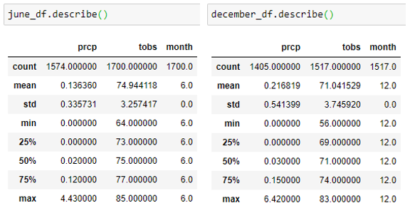

# SurfnShake

## Climate Analysis

### Comparison of June and December Data

### Recommendations for further analysis
- Oahu visitor data, including data specific to the area the shop will be located
    - Review recurring surfing events that may take place
- Competitor data - Other ice cream shops, other surf shops
- Property values over the years in the area may indicate how desirable the location is
- Longevity of other business in the area
- Recurring surfing events
- Performing the same analysis but based on other areas of the world where surfing is popular

